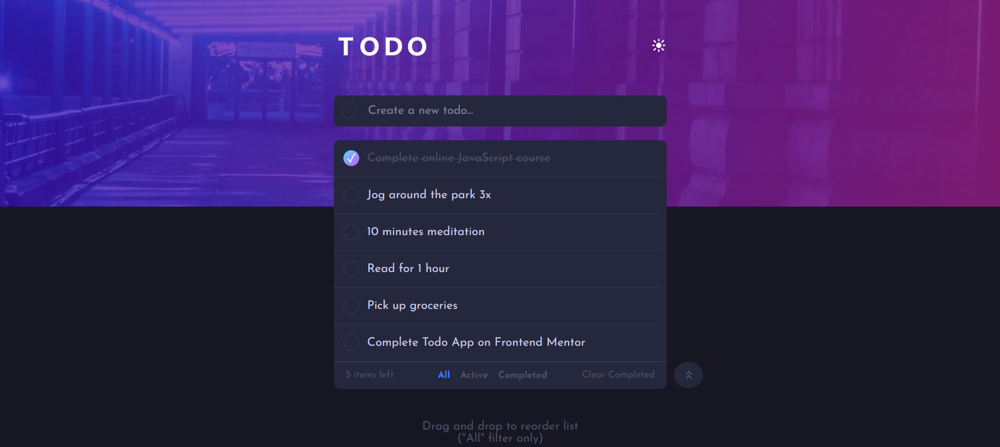

# To-Do App - QA Manual Testing Portfolio

> A feature-rich task management application demonstrating **manual testing expertise** and quality assurance practices.

**🔗 Links:** [Live Demo](https://mike-flores.github.io/advanced-todo-app/) | [Test Cases](./TEST_CASES.md) | [GitHub Repo](https://github.com/Mike-Flores/advanced-todo-app)

## 

## 🎯 Project Overview

This project showcases my **QA Manual Testing skills** through:

- ✅ Comprehensive test case design (30+ scenarios)
- ✅ Edge case identification and validation
- ✅ Data integrity and error handling testing
- ✅ User experience testing
- ✅ Responsive design validation

**Built as a solution to:** [Frontend Mentor Challenge](https://www.frontendmentor.io/challenges/todo-app-Su1_KokOW)

---

## ✨ Features Tested

### 📋 Core Task Management

- Add, edit, delete tasks
- Mark tasks as complete/pending
- Filter by status (All/Active/Completed)
- Drag and drop reordering (All filter only)
- Persistent storage (localStorage)

### 🧩 Advanced Functionality

- **Import/Export System**
  - Merge or replace modes
  - Partial import with error reporting
  - Duplicate detection
  - JSON validation

- **Bulk Operations**
  - Complete all tasks
  - Clear completed tasks
  - Clear all (with rollback on failure)

- **Additional Features**
  - Dark/Light theme toggle
  - Statistics dashboard
  - 5-second undo timer for filtered tasks

### 📱 Responsive Design

- **Tested Viewports:** 320px - 1280px

**Testing Method:** Manual browser resize testing

**Browser Compatibility:**

- ✅ Firefox (primary testing environment via Live Server)
- ⚠️ Cross-browser testing pending (Chrome, Safari, Edge)

**Note:** App requires HTTP server (Live Server, etc.) for localStorage functionality during local development.

### ♿ Accessibility

**Current Implementation:**

- ✅ Keyboard navigation (Tab, Enter, Space)
- ✅ Focus indicators on interactive elements
- ✅ Semantic HTML structure
- ✅ Hover and focus states for buttons

---

## 🧪 Testing Documentation

### Test Coverage: 30+ Manual Test Cases

**Categories:**

1. **CRUD Operations** (9 cases) - Add, edit, delete, toggle status
2. **Bulk Actions** (8 cases) - Complete all, clear all, clear completed
3. **Import/Export** (11 cases) - File validation, merge/replace logic, error handling
4. **UX & State** (7 cases) - Drag-and-drop, undo timer, theme persistence

**Testing Highlights:**

- ✅ Positive and negative test scenarios
- ✅ Edge cases (empty states, invalid data, quota limits)
- ✅ Data integrity validation
- ✅ Error message verification
- ✅ Error log
- ✅ Rollback mechanism testing

**[📋 View Complete Test Cases](./TEST_CASES.md)**

---

## 🧪 Testing Resources

### Test Data Files Included

This repository includes pre-configured JSON files for comprehensive import testing:

**📁 Location:** [Files for testing import feature](./Files_for_testing_import_feature/)

**Usage:** Open the more options menu (︽ on desktop, ︾ on mobile), and import via the Import tasks button to test error handling, validation, and user feedback.

**Positive Test Cases:**

- ✅ `Basis for the tests.json` (Merge/Replace mode) - Standard dataset
- ✅ `All valid and new.json` (Merge/Replace mode) - Clean import scenario

**Edge Cases:**

- ⚠️ `All valid but duplicated.json` (Merge mode) - Tests duplicate detection
- ⚠️ `Mixture of new and duplicate entries.json` (Merge mode) - Tests partial import logic
- ⚠️ `Empty array.json` (Merge/Replace mode) - Tests empty file handling

**Negative Test Cases:**

- ❌ `All with invalid format.json` (Merge/Replace mode) - Missing properties, incorrect types
- ❌ `A mixture of everything.json` (Merge mode) - Valid + duplicate + invalid entries
- ❌ `Not valid json.json` (Merge/Replace mode) - Malformed JSON structure
- ❌ `Not json file.txt` (Merge/Replace mode) - Wrong file type. **Note:** File picker shows only .json files by default

---

## 🐛 Quality Assurance Process

### Testing Approach

1. **Manual testing** following documented test cases
2. **Exploratory testing** to identify edge cases
3. **Regression testing** after bug fixes
4. **Responsive design validation**

### Key Findings & Resolutions

- Implemented rollback mechanism for critical operations (TC-14)
- Added duplicate detection in import flow (TC-23)
- Disabled drag-and-drop on filtered views to prevent data inconsistency (TC-29)
- Added 5-second undo timer for better UX (TC-32)

## 🛠️ Tech Stack

- **Languages:** HTML5, CSS3, Vanilla JavaScript (ES6+)
- **APIs:** localStorage, HTML5 Drag and Drop API
- **Architecture:** Modular design with separation of concerns
- **No frameworks or libraries**

---

## 👀 Known Limitations:

- Focus management in Statistics modal needs improvement
- Screen reader announcements not fully tested
- localStorage dependency: App requires localStorage to be enabled.
  If disabled, tasks, theme and current filter cannot be saved.

---

### 🚀 Planned Improvements (Roadmap)

- UI Optimization: Implement a maximum height and custom scrollbar for the Import Error Report to maintain layout integrity when processing large datasets with multiple errors.
- localStorage dependency: Implement fallback or clear error message for
  users with localStorage disabled.
- Search & Filter Synchronization: Implementation of a real-time search bar that respects active filters (All/Active/Completed) for enhanced task discoverability.
- Human-Friendly Export Options: Adding support for .csv (Excel) and .pdf formats to allow users to manage their data outside the application environment.
- Extended Browser Testing: Perform full cross-browser validation (Safari, Chrome, Edge) to ensure 100% compatibility.

---

## 📬 Contact

**Mike Flores** - Aspiring QA Manual Tester

---

## 📄 License

This project is a portfolio piece. Original challenge by [Frontend Mentor](https://www.frontendmentor.io).
